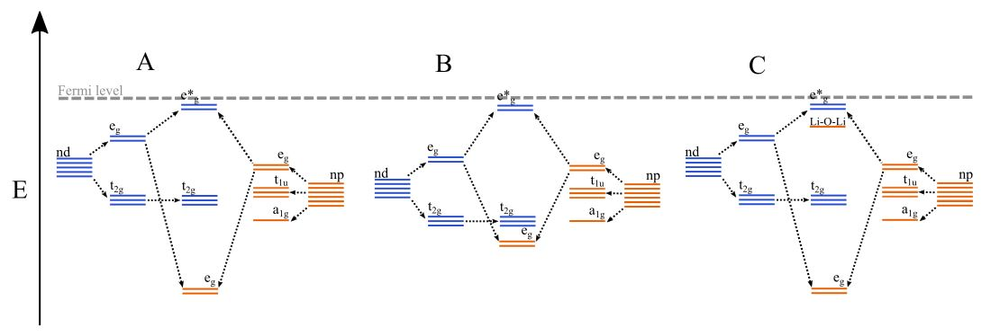

## Anionic Redox in Cathode materials

**Post 2**

**21/1/2018**

Beyond the solid state electrolytes that I mentioned, the other key component of a battery that stands to make gains in its component materials is the cathode. I'd like to split this discussion in to two parts; first, an accessible discussion around these materials, followed by a much less accessible discussion of the science behind some of the new direction in the field. 

### Battery Cathodes

A cathode is one of the two electrodes that are seperated by our electroylte. It is this cathode that is one of the major limiting factors in advances in battery materials, and therefore a subject of a great deal of the research in the field. While the battery is discharging, lithium ions arrive at the cathode from our other electrode (the anode) via the electrolyte. Separatley, electrons have gone round the external circuit to power whatever device our battery is hooked up to. The lithium and electrons meet at the cathode and wait until the process is reveresed on discharge. The capacity of the cell is determined by how much Li each electrode can hold, as this will in turn determine how many electrons are released through the circuit. If you didn't already know, electron flow is electricity. Therefore, in simple terms, the more Li your electrodes can store, the more electricity your battery can release.

The limiting factor in battery capacities is the cathode. Traditional cathode materials include transition metal oxides (a structure comprising common metals such as iron, and oxygen). In these materials, the electrons that arrive from the external circuit are stored on the transition metals. This is owing to the fact that these metals have variable oxidation states - they are stable with different numbers of electrons. The same is not true of oxygen. It has very fixed oxidation states and will not readily accept electrons from the external circuit. However, more and more potential cathode materials are being discovered that have *redox active anions*. This means that the oxygens themselves can in fact accept electrons from our external circuit, and in turn contribute to the capacity of the cathode. This allows for the capacity of the material to exceed previous limits. This process battery scientist are trying to fully understand; while our increase in capacity is highly desirable, what is not so desirable is the reduction in the structual stability of our cathode when the oxygen ions start reacting with electrons. In other words, when oxygen in the cathode reacts, the cathode starts to degrade. 

Why it is that some of these materials have reactive oxygen and some do not, is the subject of the next section of this post, the sciency bit. 

### Anionic Redox and Molecular Orbital Theory

I have structured these short paragraphs as the information I would have liked to have had condensed for me when I started reading about the subject. This is mostly intended notes for myself. Should someone discover it, and find it to be useful, amazing. 

Most materials considered for anionic redox processes adopt a rock-salt related structure. In such a configuration, the metal dx2-y2 and dz2 orbitals will overlap with anion p states along the M-L bond direction to form antibonding e\*g and bonding eg states. The dxy, dyz and dxz orbitals form non-bonding t2g states. Owing to lower electronegativity of the metal ions as compared to the p ions the t2g and e\*g are dominated by d electrons. The p electronsy reside in the eg bonding state and a1g and t1u states formed from the overlap of metal p and s states with anion p states. As the cathode is delithated, the states closest to the Fermi level will be oxidise first, if there are readily accesible anion states that reside close to the Fermi level, anionic redox should occur. 

This figure shows the partial molecular orbital diagrams for a number of cathode materials: 
* A shows a conventional cathode material, the M and anion states will be well separated, we would not expect to see oxidation of anionic states. 
* B may exhibit anionic redox, the Fermi level will drop as more electrons are removed from the system. After initial metal oxidation, the anion states and metal d states become similar in energy; their mixing will result in compettition between anionic redox and metal redox, with the exact nature of the mixing determining the extent of both. 
* C shows a specific case, In 2016 Ceder and co workers uncovered the origin of anion redox in lithium rich layered and cation disordered materials. Oxygen redox occurs preferentially along the the Li-O-Li configuration which is present in such materials. This is because this structure results in an extra antibonding state that is high in energy, but does not contain a contribution from metal d-electrons. Increases in the Li/M ratio increases the number of Li-O-Li motifs in the lattice and thus a greater contribution of oxygen redox. 

There are still mysteries in the study of these anionic redox cathodes. Some materials that we would expect to show anionic redox seemingly inexplicably do not exhibit any such property, and also how to best control the extent of anion/metal redox, this is important as not only do we want to improve cathode capacity, but also to not sacrifice too much stability as anion redox can lead to highly undersiable structural distortion, to be discussed more another time.

* [Basic function of Li-ion battery function](https://energy.gov/eere/articles/how-does-lithium-ion-battery-work)
* [Review on anionic redox](http://doi.wiley.com/10.1002/adma.201701054)
* [Anionic redox in lithium-rich cathode materials](https://www.nature.com/articles/nchem.2524)  
